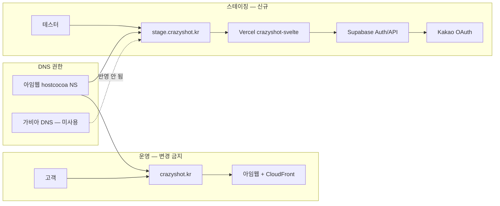

# stage.crazyshot.kr 도메인 오픈 — 전체 설정 기록

> crazyshot.kr — 촬영장비 렌탈 플랫폼 | SvelteKit 5 + Supabase + Vercel + 카카오 로그인  
> 작성일: 2026-06-18 | 작성 근거: 본 채팅 세션 실제 진행 내역  
> 최종 결과: `https://stage.crazyshot.kr/` 공개 오픈 (CRAZYSHOT SvelteKit 랜딩 표시)

---

## Context

운영 사이트 `crazyshot.kr`(아임웹)은 그대로 두고, 신규 SvelteKit 앱을 **스테이징 전용 URL** `stage.crazyshot.kr`에서 검증·개발하기 위한 인프라·인증 콘솔 설정을 진행했다.  
본 문서는 **가비아 / 아임웹 DNS / Vercel / Supabase / 카카오 Developers** 설정을 **단계별·누락 없이** 기록한다.

---

## 전체 아키텍처 (설정 후)



| URL | 역할 | 호스팅 | DNS 관리 |
|-----|------|--------|----------|
| `crazyshot.kr` / `www` | 운영(아임웹 쇼핑몰) | CloudFront | 아임웹 NS |
| `stage.crazyshot.kr` | SvelteKit 스테이징 | Vercel | 아임웹 NS (CNAME) |
| `*.supabase.co/auth/...` | OAuth callback | Supabase | (Supabase) |

---

## Phase 0 — 사전 이해 (가비아 문의 · DNS 구조)

### 0-1. 증상

- `dig @cns1.hostcocoa.com stage.crazyshot.kr` → **NXDOMAIN**
- 가비아 DNS 관리툴에 `stage` CNAME을 넣어도 반영되지 않음

### 0-2. 가비아 고객센터 답변 요지

- `crazyshot.kr` 네임서버: `cns1~4.hostcocoa.com` (가비아 DNS **아님**)
- DNS 레코드는 **네임서버 업체(= hostcocoa / 아임웹)** 에서 설정해야 함

### 0-3. 실제 확인 결과

| 항목 | 값 |
|------|-----|
| NS | `cns1.hostcocoa.com`, `cns2`, `cns3`, `cns4` |
| `hostcocoa` 정체 | **아임웹(Imweb) 전용 DNS** (별도 Hostcocoa 로그인 사이트 없음) |
| SOA | `awsdns-hostmaster.amazon.com` (AWS Route 53 기반) |
| `crazyshot.kr` A | `13.225.117.x` (CloudFront) |
| HTTP 응답 | `IMWEBVSSID` 쿠키, `via: cloudfront.net` → **운영 = 아임웹** |
| 카카오 로그인 | **DNS 변경 불필요** (콘솔 URL 등록만) |

### 0-4. 운영 도메인 보호 원칙

- 아임웹 DNS에서 `@`, `www` A 레코드(자동 설정) **수정·삭제 금지**
- 가비아에서 **NS를 가비아 DNS로 변경 금지** (운영 단절)
- 가비아 DNS 레코드: **삭제해도 무방**(반영 안 됨), **넣어도 무의미**

---

## Phase 1 — Supabase 사전 준비 (카카오·stage URL 등록 전)

> 카카오 Redirect URI에 Supabase callback URL이 필요하므로 **Supabase Project URL을 먼저 확보**한다.

### 1-1. Supabase Dashboard 접속

1. [https://supabase.com/dashboard](https://supabase.com/dashboard) 로그인
2. 크레이지샷 프로젝트 선택

### 1-2. Project URL · Anon Key 확인

| 메뉴 | 항목 | 용도 |
|------|------|------|
| **Settings → API** | **Project URL** | Kakao Redirect URI 조합 |
| **Settings → API** | **anon public** key | 앱 `.env` / Vercel env |

**Project URL 예시 형식:**

```
https://[프로젝트ID].supabase.co
```

### 1-3. Kakao OAuth용 Callback URL (고정 규칙)

```
https://[프로젝트ID].supabase.co/auth/v1/callback
```

> `[프로젝트ID]` = Project URL의 `https://` 와 `.supabase.co` 사이 문자열  
> **카카오에 `crazyshot.kr/auth/...` 형태를 넣지 않음** — Supabase가 OAuth 중간 처리

### 1-4. (선행) Vercel 환경 변수 연동 준비

로컬 [`.env.example`](../../.env.example) 기준, Vercel에도 동일 키 필요:

| 변수 | 설명 |
|------|------|
| `VITE_SUPABASE_URL` | Project URL |
| `VITE_SUPABASE_ANON_KEY` | anon key |

Vercel: **Project → Settings → Environment Variables** (Production / Preview / Development 각각 또는 공통)

---

## Phase 2 — 카카오 Developers 설정 (앱 0개 → 신규 생성)

> DNS 작업 **없음**. 본 채팅에서 **콘솔 설정 완료** 확인됨.

### 2-1. 개발자 등록 · 로그인

1. [https://developers.kakao.com](https://developers.kakao.com) 접속
2. **로그인** (카카오 계정)
3. 최초 이용 시 개발자 등록·약관 동의

### 2-2. 애플리케이션 생성 (앱이 없을 때)

| 순서 | 메뉴 | 작업 |
|------|------|------|
| 1 | **내 애플리케이션** | 클릭 |
| 2 | **애플리케이션 추가하기** | 클릭 |
| 3 | 앱 이름 | 예: `크레이지샷` / `CrazyShot` |
| 4 | 사업자명 | 실제 사업자명 |
| 5 | 카테고리 | 쇼핑 / 서비스 등 |
| 6 | **저장** | 앱 대시보드 진입 |

### 2-3. Web 플랫폼 · 사이트 도메인

**메뉴:** **앱 설정 → 플랫폼 → Web 플랫폼 등록**

| 사이트 도메인 (한 줄씩) | 용도 |
|-------------------------|------|
| `https://crazyshot.kr` | 운영(향후) |
| `https://stage.crazyshot.kr` | 스테이징 |
| `http://localhost:5173` | 로컬 개발 |

### 2-4. 카카오 로그인 활성화

**메뉴:** **제품 설정 → 카카오 로그인**

| 순서 | 항목 | 설정 |
|------|------|------|
| 1 | **사용 설정** | **ON** |
| 2 | **Redirect URI** → 등록 | `https://[프로젝트ID].supabase.co/auth/v1/callback` |
| 3 | (선택) **동의항목** | 닉네임 필수, 이메일·프로필 선택 |

**오류 참고:**

| 코드 | 원인 |
|------|------|
| KOE004 | 카카오 로그인 OFF |
| KOE006 | Redirect URI 불일치 |

### 2-5. 키 발급 (Supabase에 입력할 값)

**메뉴:** **앱 설정 → 앱 키**

| 카카오 | Supabase 필드 |
|--------|---------------|
| **REST API 키** | Kakao **Client ID** |
| **Client Secret** | Kakao **Client Secret** |

Client Secret 비활성 시: **앱 설정 → 고급 → Client Secret → ON** 후 코드 복사

> JavaScript 키가 아닌 **REST API 키** 사용

### 2-6. 카카오 OAuth 흐름 (코드 연동 기준)

프로젝트: [`src/lib/services/supabase.ts`](../../src/lib/services/supabase.ts) — `signInWithOAuth({ provider: 'kakao' })`

```
[사용자] stage.crazyshot.kr 에서 카카오 로그인 클릭
    ↓
[Supabase Auth] OAuth 시작
    ↓
[카카오] 로그인·동의
    ↓
[Supabase] https://[프로젝트ID].supabase.co/auth/v1/callback
    ↓
[stage.crazyshot.kr] 세션 확립 후 복귀
```

> **로그인 UI 페이지(`/auth/login`)는 아직 미구현** — 콘솔 연결만 완료 상태

---

## Phase 3 — Supabase Authentication 설정

> 본 채팅에서 **카카오 Provider + URL Configuration 완료** 확인됨.

### 3-1. Kakao Provider 활성화

1. Supabase Dashboard → **Authentication**
2. **Providers** (또는 Sign In / Providers)
3. **Kakao** 찾기 → **Enable**
4. 입력:

| Supabase 필드 | 값 |
|---------------|-----|
| Client ID | 카카오 REST API 키 |
| Client Secret | 카카오 Client Secret |

5. **Save**

### 3-2. URL Configuration

**메뉴:** **Authentication → URL Configuration**

| 항목 | 권장 값 |
|------|---------|
| **Site URL** | `https://stage.crazyshot.kr` (스테이징 우선) 또는 `https://crazyshot.kr` |
| **Redirect URLs** | 아래 추가 |

**Redirect URLs 목록 (한 줄씩):**

```
https://stage.crazyshot.kr/**
https://crazyshot.kr/**
http://localhost:5173/**
```

### 3-3. 스테이징·운영 분리 시 주의

- stage에서 카카오 로그인 테스트 → Kakao Redirect URI는 **Supabase callback 1개**로 충분 (도메인 무관)
- Supabase **Redirect URLs**에 `stage.crazyshot.kr` 포함 필수 (로그인 후 복귀)
- Kakao **사이트 도메인**에도 `stage.crazyshot.kr` 등록 (Phase 2-3)

### 3-4. 검증 (콘솔만)

- [ ] Kakao: Redirect URI = Supabase callback 정확히 일치
- [ ] Supabase: Kakao Provider Enabled + 키 저장
- [ ] Supabase: Redirect URLs에 stage·localhost 포함
- [ ] (코드 배포 후) 브라우저 카카오 로그인 E2E — **향후 작업**

---

## Phase 4 — Vercel 프로젝트 · 배포 · 도메인

### 4-1. 프로젝트 연결

1. [https://vercel.com](https://vercel.com) 로그인
2. 프로젝트 **`crazyshot-svelte`** (Git 저장소 연동)
3. Framework: **SvelteKit** (자동 감지)
4. 배포 성공 확인 (`*.vercel.app` URL)

### 4-2. Environment Variables

**Settings → Environment Variables**

| Name | Value | Environment |
|------|-------|-------------|
| `VITE_SUPABASE_URL` | Supabase Project URL | Preview + Production |
| `VITE_SUPABASE_ANON_KEY` | Supabase anon key | Preview + Production |
| (기타) | `.env.example` 참고 | 필요 시 |

변경 후 **Redeploy** 필요할 수 있음.

### 4-3. Custom Domain 추가

**Settings → Domains → Add**

| 입력 | 값 |
|------|-----|
| Domain | `stage.crazyshot.kr` |

추가 후 Vercel이 **DNS 설정 안내** 표시:

| 항목 | 본 프로젝트 실제 값 |
|------|---------------------|
| 타입 | **CNAME** |
| 호스트 | `stage` |
| **값 (프로젝트 전용)** | `19ad4e4434849cac.vercel-dns-016.com` |

> Vercel Domains 화면 값을 **그대로** 사용. 프로젝트마다 `*.vercel-dns-016.com` 형태가 다름.

### 4-4. 잘못된 CNAME (실제 발생 · 교훈)

| 값 | 문제 |
|----|------|
| `ns1.vercel-dns.com` | **네임서버 위임**용 주소 — 서브도메인 CNAME **아님** |
| 증상 | `dig`는 되나 IP `198.51.44.13`, **HTTPS 타임아웃** |
| `cname.vercel-dns.com` | 구형 공통값 — Vercel UI가 **프로젝트 전용값**을 주면 그것 사용 |

### 4-5. Domains 상태

| 상태 | 의미 |
|------|------|
| **Valid** | DNS + Vercel 연결 완료 |
| **Pending** | 전파·SSL 대기 |
| **Invalid Configuration** | CNAME 불일치 |

---

## Phase 5 — 아임웹 DNS (stage CNAME — 실제 등록)

> **가비아 DNS 아님.** 아임웹 관리자에서만 반영됨.

### 5-1. 접속 경로

1. [https://imweb.me](https://imweb.me) 로그인
2. **크레이지샷** 사이트 관리자
3. **환경설정 → 도메인 → crazyshot.kr**
4. **네임서버 설정** (모달: `crazyshot.kr 네임서버 설정`)

### 5-2. 최종 레코드 (저장 완료)

| 타입 | 이름 | 값/위치 | 비고 |
|------|------|---------|------|
| A | `crazyshot.kr` | 자동 설정 | **건드리지 않음** |
| A | `www.crazyshot.kr` | 자동 설정 | **건드리지 않음** |
| CNAME | `stage.crazyshot.kr` | `19ad4e4434849cac.vercel-dns-016.com` | Vercel Domains 안내값 |

### 5-3. 저장 · 전파

1. **레코드 추가** (stage CNAME)
2. **저장**
3. 대기: **5~30분** (최대 48시간)

### 5-4. 가비아 DNS

- 기존 가비아 DNS 레코드: **삭제 불필요** (무시됨)
- NS 변경만 **하지 않을 것**

---

## Phase 6 — Vercel Deployment Protection (장애 · 해결)

### 6-1. 증상

- `https://stage.crazyshot.kr` → **vercel.com/login** 리다이렉트
- HTTP **401**, 쿠키 `_vercel_sso_nonce`
- 본문: *"This page requires Vercel authentication"*
- **앱 버그·DNS 문제 아님**

### 6-2. 원인

**Vercel Deployment Protection / Vercel Authentication** — Preview·커스텀 스테이징 도메인에 팀 로그인 요구

### 6-3. 시도했으나 불가 (유료)

**Settings → Deployment Protection → Deployment Protection Exceptions → Add Domain**

- Hobby 플랜: **유료(Advanced Deployment Protection)** — `stage`만 예외 공개 **불가**

### 6-4. 적용한 해결 (무료)

**Settings → Deployment Protection → Vercel Authentication**

1. **Disabled** 선택
2. 확인 모달: 아래 문장 **그대로** 입력 (따옴표 없음, 소문자)

```
disable vercel authentication
```

3. **Disable Vercel Authentication** → **Save**

**부작용:** Preview·stage 포함 **배포 URL 전체 공개** (내부 테스트용 수용)

### 6-5. 대안 (미적용 · 참고)

| 방법 | 비용 | 비고 |
|------|------|------|
| Exceptions에 `stage.crazyshot.kr` | 유료 | stage만 공개 |
| Domains에서 stage → **Production** | 무료 | main 브랜치가 stage에 배포됨 |
| Vercel 팀 계정으로만 접속 | 무료 | 외부 테스터 불편 |

---

## Phase 7 — 검증 절차 (합격 기준)

### 7-1. DNS

```bash
# Hostcocoa(아임웹) 권한 DNS
dig @cns1.hostcocoa.com stage.crazyshot.kr CNAME +short

# 공용 DNS
dig stage.crazyshot.kr CNAME +short

# 운영 영향 없음 확인
dig crazyshot.kr +short
```

| 검사 | 합격 |
|------|------|
| stage CNAME | `19ad4e4434849cac.vercel-dns-016.com.` |
| crazyshot.kr | `13.225.117.x` (CloudFront) 유지 |

웹: [https://dnschecker.org](https://dnschecker.org) — `stage.crazyshot.kr` CNAME

### 7-2. Vercel

- **Domains** → `stage.crazyshot.kr` = **Valid**
- **Deployment Protection** → Vercel Authentication = **Disabled**

### 7-3. HTTPS · 브라우저

- 시크릿 창 → `https://stage.crazyshot.kr/`
- **합격:** CRAZYSHOT 리뉴얼 랜딩 (SvelteKit), login 리다이렉트 없음
- **실패:** vercel.com/login → Phase 6 재확인

### 7-4. 카카오 · Supabase (콘솔)

- Kakao Redirect URI ↔ Supabase callback 일치
- Supabase Redirect URLs에 stage 포함
- (코드) 로그인 버튼 배포 후 E2E — **미완**

---

## Phase 8 — 최종 상태 요약

| 구분 | 상태 |
|------|------|
| `stage.crazyshot.kr` DNS (아임웹 CNAME) | ✅ |
| Vercel Domains Valid | ✅ |
| Vercel Authentication | ✅ Disabled (공개) |
| `https://stage.crazyshot.kr/` 접속 | ✅ 랜딩 표시 |
| `crazyshot.kr` 운영 (아임웹) | ✅ 영향 없음 |
| 카카오 Developers 앱·로그인 ON | ✅ (콘솔) |
| Supabase Kakao Provider | ✅ (콘솔) |
| 앱 내 카카오 로그인 UI | ⏳ 미구현 |

---

## Phase 9 — 유지보수 · 재발 방지

1. **DNS 변경은 아임웹만** — 가비아 DNS 수정 무의미
2. **stage CNAME** — Vercel Domains 안내값과 **항상 동일**하게 유지
3. **Vercel Authentication 재활성화** 시 stage → login 리다이렉트 재발
4. **카카오/Supabase stage 테스트** — Redirect URLs·사이트 도메인에 stage 포함 확인
5. **운영 `@`/`www`** — 아임웹 A 자동 설정 **절대 수정 금지**

---

## 참고 링크

| 주제 | URL |
|------|-----|
| Kakao 로그인 사전 설정 | https://developers.kakao.com/docs/ko/kakaologin/prerequisite |
| Kakao 앱·키 설정 | https://developers.kakao.com/docs/ko/app-setting/app |
| Vercel Deployment Protection | https://vercel.com/docs/deployment-protection |
| Vercel Authentication | https://vercel.com/docs/deployment-protection/methods-to-protect-deployments/vercel-authentication |
| 아임웹 타사 도메인 NS | https://imweb.me/faq?category=29&category2=34&idx=71418&mode=view |

---

## 설정 순서 체크리스트 (한 페이지)

```
[Phase 0] NS=hostcocoa(아임웹) 확인 · 가비아 DNS 무시
[Phase 1] Supabase Project URL · callback URL 확보 · env 키 확인
[Phase 2] 카카오: 앱 생성 → Web 도메인 → 로그인 ON → Redirect URI → REST API 키/Secret
[Phase 3] Supabase: Kakao Provider ON → URL Configuration(Redirect URLs)
[Phase 4] Vercel: 배포 → env vars → Domains(stage) → CNAME 값 복사
[Phase 5] 아임웹: stage CNAME 등록 · @/www 유지 · 저장
[Phase 6] Vercel: Deployment Protection → Authentication Disabled
[Phase 7] dig · Domains Valid · 브라우저 stage 접속 검증
```

---

*stage.crazyshot.kr 도메인 오픈 설정 기록 | 2026-06-18 | Harness / crazyshot-svelte*
